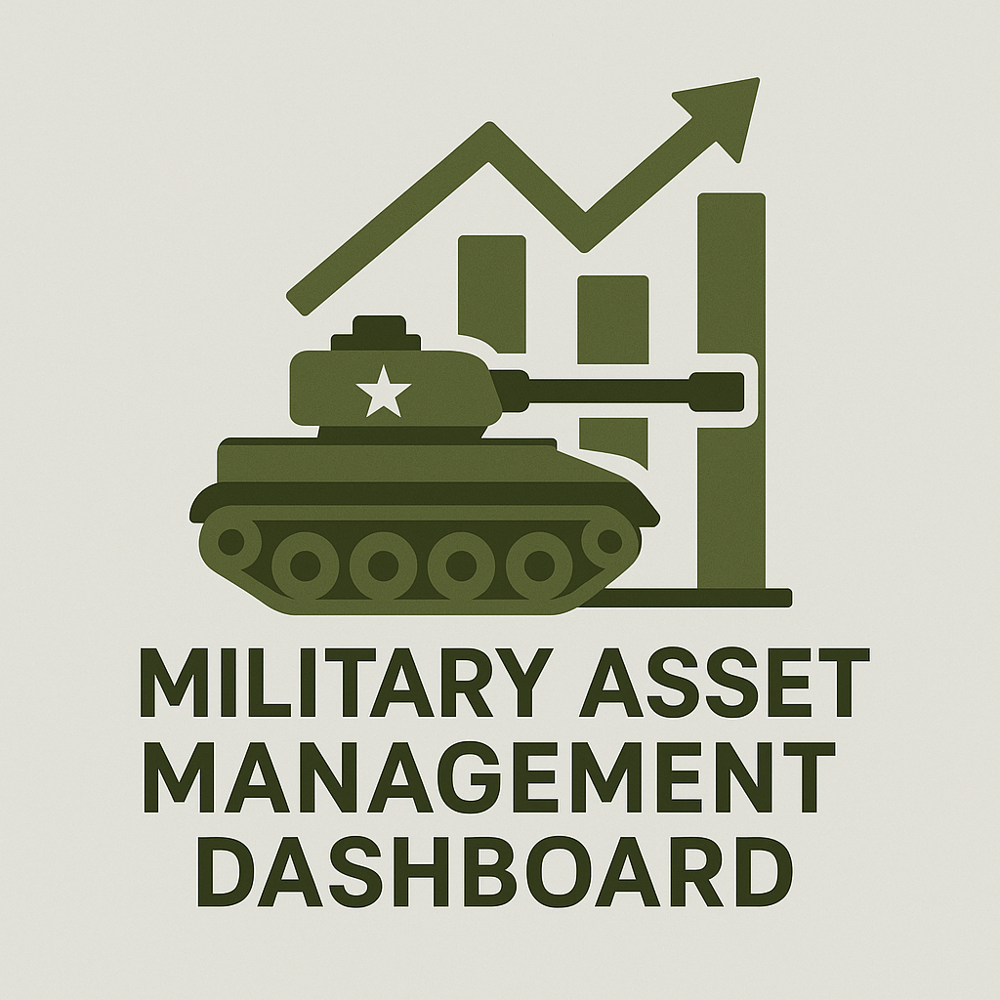

# 🚀 Military Asset Management



<p align="center">
  
  
  
  
  
</p>

---

> **A modern dashboard for managing military assets efficiently.**

[](https://github.com/vaibhavk10/Military-Asset-Management)

---

## 📸 Demo


<!-- Optionally, add a GIF for animation/transition demo -->
<!--  -->

---

## ✨ Features

- 📊 **Asset dashboard** with real-time metrics
- 🔄 **Asset assignment and transfer**
- 💸 **Purchase and expenditure tracking**
- 🛡️ **Role-based access** (Admin, Base Commander, Logistics Officer)
- 📱 **Responsive and modern UI**

---

## 🛠️ Technologies Used

- ⚡ [Vite](https://vitejs.dev/)
- ⚛️ [React](https://react.dev/)
- 🟦 [TypeScript](https://www.typescriptlang.org/)
- 🎨 [shadcn-ui](https://ui.shadcn.com/)
- 🌈 [Tailwind CSS](https://tailwindcss.com/)

---

## 🚀 Getting Started

### Prerequisites
- Node.js & npm (recommended: [nvm](https://github.com/nvm-sh/nvm#installing-and-updating))

### Installation

```sh
# Clone the repository
git clone https://github.com/vaibhavk10/Military-Asset-Management.git

# Navigate to the project directory
cd Military-Asset-Management

# Install dependencies
npm install

# Start the development server
npm run dev
```

---

## 🌐 Deployment
You can deploy this project using your preferred platform or static hosting service. For custom domain setup, refer to your hosting provider's documentation.

---

## 📂 Project Structure

```
├── src/
│   ├── components/
│   ├── pages/
│   ├── context/
│   ├── hooks/
│   └── ...
├── public/
├── index.html
└── README.md
```

---

## 🤝 Contributing

Contributions, issues and feature requests are welcome!<br />
Feel free to check [issues page](https://github.com/vaibhavk10/Military-Asset-Management/issues).

---

## 📄 License

This project is [MIT](LICENSE) licensed.

---

<p align="center">
  <b>Made with ❤️ for modern military logistics</b>
</p>
